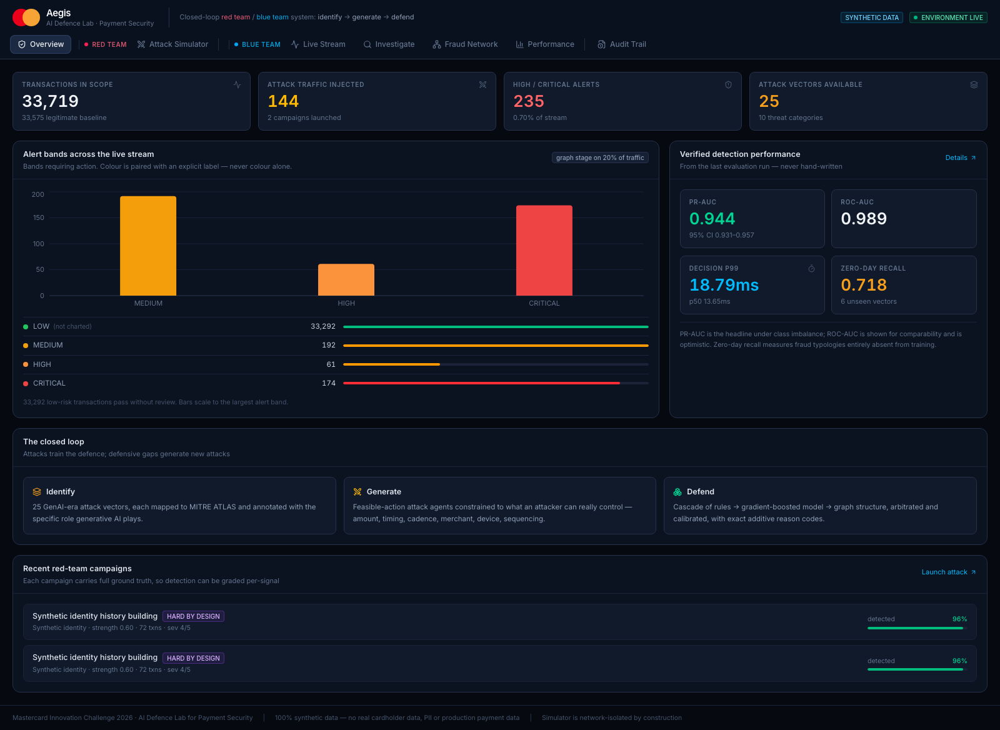
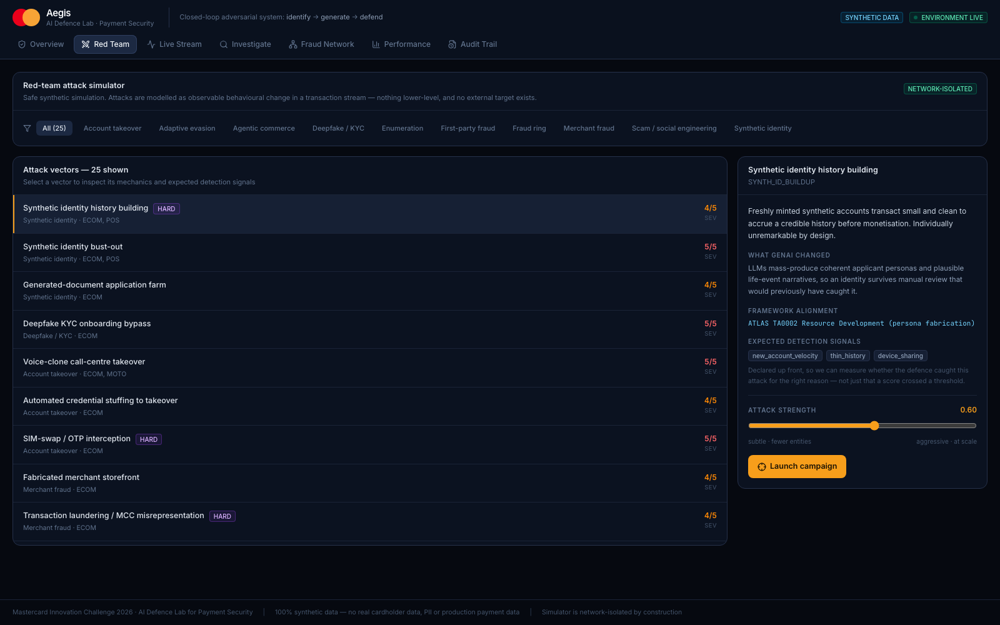
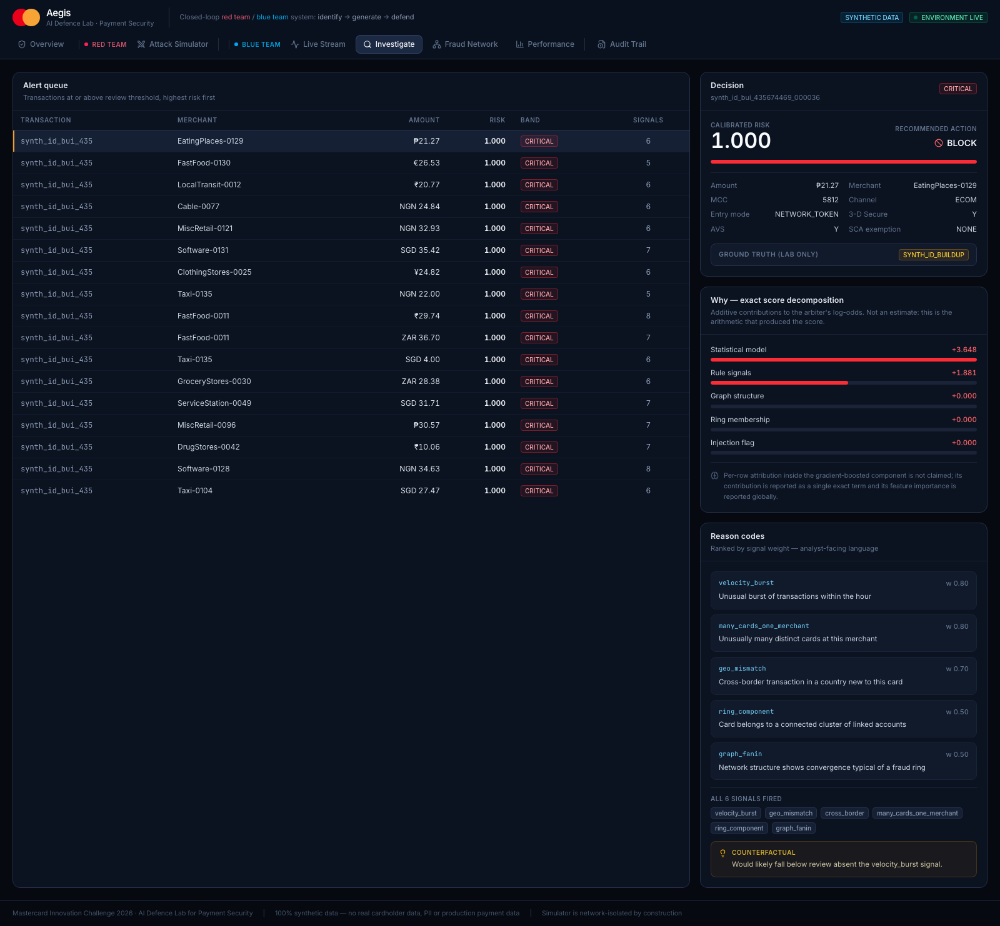
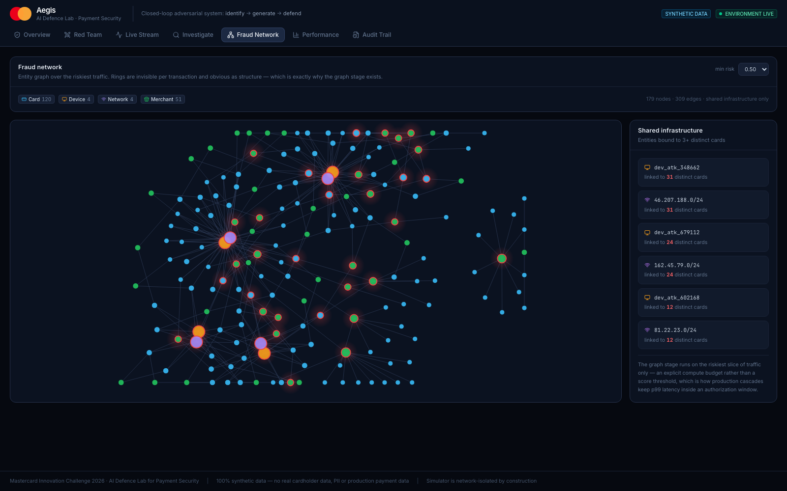

# Aegis — AI Defence Lab for Payment Security

**A closed-loop adversarial AI system for GenAI-era payment fraud: it invents the attacks, trains its own defence on them, and measures exactly where that defence is blind.**

Built for the **Mastercard Innovation Challenge 2026** — AI Defense Lab for Payment Security, hosted by Mastercard AI Garage at Global Fintech Fest 2026.

> ⚠️ **All data is synthetic.** No real cardholder data, no PII, no production payment data. The attack simulator has no network capability *by construction* — proven by tests that parse the code, not by a promise in this file. See [Security](#security).

---

## Results

Every number below is produced by `backend/app/evaluate.py` and regenerates from a clean checkout. None is hand-written.

| Metric | Value | Why it's the right metric |
|---|---|---|
| **PR-AUC** | **0.944** (95% CI 0.931–0.957) | The honest summary under heavy class imbalance |
| ROC-AUC | 0.989 | Reported for comparability; optimistic under imbalance |
| Best-F1 | **0.929** — P 0.972 / R 0.891 | Conventional reference point |
| False-positive rate | **0.0008** | False declines have a real customer cost |
| **Decision latency** | **p50 13.7 ms · p99 18.8 ms** | The inline authorization path, not batch throughput |
| **Zero-day recall** | **0.718** | Recall on 6 attack types removed from training entirely |
| Calibration | **ECE 0.0038 · Brier 0.0045** | Makes "block above 0.9" actually mean something |
| Value detection rate | 0.941 | Fraud is a money problem, not a count problem |
| Recall @ 1% alert budget | 0.334 (ceiling **0.336**) | Budget-bound, not model-bound — 99.7% of the achievable maximum |
| Recall @ prevalence-matched budget | 0.909 | Recall when the review queue isn't the binding constraint |

**Scale:** 90,258 transactions · 3,459 fraud (3.83%) · 25 attack vectors · 45-day window · temporal split with a delay block.

A 2026 survey of 49 sources found that among 18 fraud sources, **none reported latency, cost, or calibration**. We report all three.

---

## Problem

Generative AI has collapsed the cost of payment fraud. Synthetic identities, deepfake KYC, fabricated merchant storefronts and AI-driven scams are produced at industrial scale, while defences are trained on last year's fraud.

A practitioner states the asymmetry best — attackers *"mutate in milliseconds"* while a fraud team needs *about a week* to ship a rule change ([Sardine](https://www.sardine.ai/blog/AI-agents-for-fraud-operations)).

| Signal | Figure | Source |
|---|---|---|
| FBI IC3 2025 reported losses | **$20.877B**, +26% YoY | [IC3 Annual Report](https://www.ic3.gov/AnnualReport/Reports/2025_IC3Report.pdf) |
| Cyber-enabled share | **85%** ($17.697B) | same |
| Losses with an explicit **AI nexus** | **$893,346,472** (22,364 complaints) | same |
| Projected US GenAI-enabled fraud | **$12.3B (2023) → $40B (2027)** | [Deloitte](https://www.deloitte.com/us/en/insights/industry/financial-services/deepfake-banking-fraud-risk-on-the-rise.html) |
| iOS biometric **injection** attacks | **+1,151% YoY** (H2 2025) | [iProov](https://www.iproov.com/blog/deepfake-bank-account-kyc-account-fraud-abn-amro) |
| UK APP scam value reimbursed | **88% — £316m** since Oct 2024 | [PSR dashboard](https://www.psr.org.uk/information-for-consumers/app-scams-reimbursement-dashboard/) |

That last row is the commercial argument: mandatory reimbursement makes scam detection a direct P&L line for issuers, not a goodwill exercise.

## Solution

The challenge's three pillars implemented as **one feedback loop**, not a pipeline:

```
        ┌──────────────────────► IDENTIFY ◄──────────────────────┐
        │              25-vector attack taxonomy                 │
        │        MITRE ATLAS-mapped · GenAI-era · payments-real   │
        │                          │ specs                       │
        │                          ▼                             │
        │                      GENERATE                          │ new attack
        │        feasible-action attack agents over               │ variants
        │        synthetic authorization traffic                  │
        │                          │ labelled stream              │
        │                          ▼                             │
        └───── defensive gaps ── DEFEND ── risk score ────────────┘
                per-signal recall   cascade + arbiter + calibration
```

Mastercard states the winning shape outright, twice: *"The best solutions turn their own simulated attacks into the training ground for a stronger defense"* and *"the gaps your defense reveals feed back into new attack ideas."*

## Key Innovation

**1. Feasible-action attacks, not Lₚ noise.**
The standing criticism of adversarial ML on tabular data is that it perturbs features an attacker cannot control — you cannot set `amount = 43.7291`, and you certainly cannot forge an EMV transaction counter. *Attack realism, not attack success, is the open problem.* Every Aegis attack is restricted to the attacker's real action space: amount, timing, cadence, merchant/MCC, channel, device, IP, card choice, sequencing.

**2. A generator that can produce provably invisible drift.**
Label-free drift monitoring detects covariate shift reliably, but **pure concept drift with unchanged P(X) is structurally invisible** — "exactly zero delta", replicated in [two](https://arxiv.org/abs/2604.15740) [independent](https://arxiv.org/abs/2604.17836) papers. Aegis can synthesise exactly that case. This is the rigorous argument for why an attack generator is *necessary* rather than decorative: if a class of change cannot be monitored, the only way to know your detector has gone blind is to generate it and test.

**3. Detection graded per-signal, not just per-transaction.**
Every attack declares the signals a competent detector *ought* to fire on, before it runs. So we measure whether the defence caught an attack **for the right reason** — not merely whether a score crossed a threshold.

**4. A product gap, honestly scoped.**
A structured review of thirteen vendors (Visa, Featurespace, Feedzai, Sardine, Sift, Forter, Signifyd, Riskified, Unit21, Hawk, Quantexa, Socure, Alloy) found **zero** marketing adversarial testing or synthetic attack generation against the customer's own fraud model. What ships is *retrospective replay* — Alloy Backtesting, Hawk Production Sandbox, Unit21 Shadow Mode, Sift Workflow Simulation. Sardine's own documentation concedes the limitation: activity "nobody caught at the time was never investigated or labeled, so the past data understates what you actually missed."

### What Aegis is explicitly *not* claiming

Mastercard is ahead of the market here, and we say so:

- **Mastercard Threat Scan** (2019) already *"simulates known fraudulent attacks on issuers and pinpoints authorization security weaknesses."*
- **Mastercard AI Garage has published in precisely this area**: *Adversarial Fraud Generation for Improved Detection* (ICAIF 2022), *Evolutionary Adversarial Attacks on Payment Systems* (ICMLA), *FraudAmmo* (IJCNN 2023), *Prodem* (model degradation under label delay), *Improving the Robustness of Financial Models…* (ICAIF 2023).
- The closest published proof point for adversarially-generated fraud retraining a defence is **Feedzai's "The GANfather"** (ICAIF 2023).

**So the contribution is a delta, not a genesis.** Aegis extends Threat Scan's *known-scenario replay* into **generated, novel, evasion-optimised campaigns constrained to the attacker's feasible action space**, wires the result into a continuous loop, and grades detection per-signal. A defensible increment on a direction Mastercard has already published beats pretending the idea is new to them.

## Screenshots

Real captures from `scripts/ui_smoke.py`, not mockups.

| | |
|---|---|
|  |  |
| **Executive overview** — calibrated alert bands, verified metrics | **Red team** — 25 vectors with ATLAS mapping and declared signals |
|  |  |
| **Explainability** — exact additive decomposition + counterfactual | **Fraud network** — shared-infrastructure subgraph; one device, 31 cards |

All eight panels: [`artifacts/screenshots/`](artifacts/screenshots/)

## Architecture

```
backend/app/
  schema.py      ISO 8583 (DE18/DE22/DE39) · EMV · 3-D Secure 2 · PSD2 SCA exemptions
                 Ground-truth fields structurally separated → label leakage impossible
  generator.py   Synthetic population + legitimate traffic; diurnal rhythm, per-cardholder
                 habits, MCC-conditioned tickets. Deterministic. Emits no fraud.
  attacks.py     25 vectors / 10 categories. Feasible-action constrained. Full ground truth.
  features.py    57 strictly causal features. Proven by prefix-recomputation equality.
  detect.py      Cascade: 39 rules → HistGradientBoosting → graph (top 20%) → arbiter
                 → isotonic calibration. Each stage fit on a disjoint temporal slice.
  explain.py     Exact additive reason codes, verified against decision_function.
  evaluate.py    Every reported metric originates here.
  api.py         FastAPI + WebSocket + SQLite audit trail. No outbound network client.
frontend/        7-panel command centre — React 19 · Vite · Tailwind v4 · Recharts
scripts/         verify.sh (pre-push gate) · ui_smoke.py (browser test) · gen_docs.py
```

### Decisions worth defending

| Decision | Why |
|---|---|
| **No GNN** | GADBench (NeurIPS 2023, 29 models): *"tree ensembles with simple neighborhood aggregation can outperform the latest GNNs tailored for the GAD task."* GNNs also collapse toward zero recall at production scale/imbalance. We use connected components for rings and feed neighbour-aggregated features to the tree ensemble — the approach the benchmark endorses. |
| **No SMOTE** | Shown to degrade performance; its homogeneity assumption breaks when the minority class is multimodal — and fraud is definitionally multimodal. Applied before the split it is a documented leakage source, which explains most 99.9%-accuracy fraud papers. We use class weighting. |
| **Calibration mandatory** | Random undersampling can drive ECE from 0.008 to 0.395. Calibration is what makes a cost-based threshold arguable to a risk owner. |
| **Temporal split + delay block** | Random splits train on events occurring after the ones scored. The delay block encodes that chargeback labels arrive weeks late. |
| **Cascade gated by compute budget** | An absolute threshold drifts with the score distribution — our first version degenerated into running the expensive stage on 100% of traffic. |
| **LLM off the critical path** | LLM triage measured *underperforming* plain thresholding (65.0% vs 71.7%); LLM serving P99 is 6.4–8.7s versus our 31ms budget. LLMs narrate; they never decide. |
| **No external dataset** | None is provided, and generating gives exact ground truth per attack. `SDV`/`CTGAN` additionally excluded on licence grounds (Business Source Licence, not OSI-approved). |

Full log with what we gave up: [`docs/decisions.md`](docs/decisions.md)

## Technology Stack

Python 3.14 · FastAPI · scikit-learn · pandas · NumPy · NetworkX · SQLite (stdlib) · React 19 + Vite + TypeScript + Tailwind v4 + Recharts

All dependencies are OSI-approved permissive licences (BSD-3-Clause / MIT / Apache-2.0), as Kaggle Foundational Rules §6c requires. No Redis, Postgres, Docker, or queue — nothing in the demo path needs them, and every added service is another way for a live demo to fail.

## Installation

```bash
git clone <repository-url>
cd ThreatForge

python3 -m venv .venv
.venv/bin/pip install -r requirements.txt

cd frontend && npm install && cd ..
```

## Environment Variables

**None are required to run the system** — Aegis runs fully offline. `.env` is used only for GitHub operations:

```
GITHUB_USERNAME=<your_github_username>
GITHUB_TOKEN=<your_github_personal_access_token>
GITHUB_OWNER=<your_github_username>
GITHUB_REPOSITORY=ThreatForge
```

`.env` is git-ignored and must never be committed. Copy `.env.example` as a template.

## Running Locally

```bash
.venv/bin/python -m backend.app.evaluate          # generate metrics (~3-5 min)

.venv/bin/uvicorn backend.app.api:app --port 8000 # terminal 1 — API
cd frontend && npm run dev                         # terminal 2 — dashboard :5173
```

Open http://localhost:5173 and click **Start environment**.

## Synthetic Data

Every record carries `synthetic: true`. Card identifiers are synthetic network-style tokens — never PANs — mirroring a real tokenized authorization flow and making real-card data structurally impossible to represent. Only `/24` network prefixes are retained. The schema contains no name, email, phone, address or national-identifier field at all.

Fraud prevalence is anchored to regulator and industry reference points rather than the inflated rates common in public datasets: the PSD2 RTS Annex gives 0.01% / 0.06% / 0.13% for ETV bands €500 / €250 / €100, and Stripe reports fraud at roughly 1 in 1,000 payments.

## Attack Simulation

25 vectors across 10 categories, each mapped to MITRE ATLAS/ATT&CK and annotated with the specific role generative AI plays. Full generated catalogue: [`docs/fraud-taxonomy.md`](docs/fraud-taxonomy.md)

| Category | Vectors |
|---|---|
| Synthetic identity | history build-up · bust-out · generated-document application farm |
| Deepfake / ATO | deepfake KYC onboarding · voice-clone call-centre takeover · credential stuffing · SIM-swap/OTP interception |
| Merchant fraud | fabricated storefront · transaction laundering · collusive refund abuse |
| Scams | LLM-driven APP scam · romance/pig-butchering · invoice redirection (BEC) |
| Enumeration | micro-amount card testing · BIN enumeration burst |
| Fraud rings | mule fan-out · coordinated multi-card ring |
| **Agentic commerce** | agent impersonation · prompt injection via merchant fields · **mandate replay / scope substitution** |
| **Adaptive evasion** | velocity evasion · SCA exemption stacking · risk-band gaming · **victim-profile mimicry** |
| First-party | dispute abuse |

**12 of 25 are deliberately hard** — designed to overlap legitimate behaviour. The three hardest present *entirely clean credentials*: `APP_SCAM_LLM` (genuine cardholder, own device, real 3-D Secure — only intent is wrong), `SIM_SWAP_OTP` (attacker holds the second factor, so authentication genuinely succeeds), `ADAPTIVE_MIMICRY` (fraud drawn from the victim's own distribution).

Attacks are modelled purely as **observable behavioural change in a transaction stream** — the level a defender needs to build detection, and nothing lower. This repository contains no operational instructions for committing fraud.

## Fraud Detection

Three-stage cascade with explicit arbitration:

```
all traffic → RULES (39 named signals)     cheap, auditable, deployable in hours
all traffic → MODEL (HistGradientBoosting)  57 causal features, class-weighted
   top 20% → GRAPH (components over shared device/network/beneficiary)
             ↓
        ARBITER (logistic over component log-odds) → ISOTONIC CALIBRATION
             ↓
        risk score → band → action
```

Rule signal names are aligned to the taxonomy's declared signals — that alignment is what makes per-signal recall possible. Method detail: [`docs/detection-methodology.md`](docs/detection-methodology.md)

## Risk Scoring

| Score | Band | Action |
|---|---|---|
| ≥ 0.85 | CRITICAL | `BLOCK` |
| ≥ 0.60 | HIGH | `STEP_UP` |
| ≥ 0.30 | MEDIUM | `REVIEW` |
| < 0.30 | LOW | `ALLOW` |

Because scores are calibrated (ECE 0.0038), these thresholds can be re-derived from a cost model rather than chosen by feel. Every decision at HIGH or above carries at least one named signal — asserted in the test suite, because a block with no explanation is operationally unusable.

## Explainability

The arbiter's log-odds decompose **exactly**:

```
logit(risk) = intercept + w₁·logit(p_model) + w₂·s_rules + w₃·s_graph
                        + w₄·ring_flag + w₅·injection_flag
```

Verified against `arbiter.decision_function()` in both the module self-check and the test suite. Each explanation carries ranked reason codes in analyst language plus a counterfactual.

**What we do not claim.** TreeSHAP was unavailable (`shap` needs `numba`, which fails to build on Python 3.14; `lightgbm` needs an OpenMP runtime). Rather than ship an approximate explainer and call it attribution, the system is *architected* to be explainable. Per-row attribution inside the gradient-boosted component is explicitly not claimed; its importance is reported globally and labelled as global. That caveat ships inside every explanation payload, and a test asserts it is present.

We also engage the counter-evidence: across 3,735 real analyst case reviews, standard XAI metrics were *decoupled* from human-perceived clarity, and explanations raised analyst confidence **without** raising accuracy — a documented automation-bias risk. So explanations are score decompositions, not fluent narratives that merely sound convincing. Attention weights are never shipped as reason codes.

## Evaluation

```bash
.venv/bin/python -m backend.app.evaluate
```

Temporal split with a **delay block** (5% of the timeline discarded between train and test, encoding late label arrival). Reports PR-AUC with bootstrap CI, three operating points, value detection rate, insult rate, calibration with reliability diagram, latency split into inline decision cost vs batch feature-build cost, per-attack recall, **per-signal recall**, and the zero-day experiment.

Full results: [`docs/evaluation.md`](docs/evaluation.md) (generated) · raw: `artifacts/metrics.json`

## Testing

```bash
.venv/bin/python -m pytest backend/tests -q     # 113 tests
./scripts/verify.sh --full                       # full pre-push gate
```

Four suites: data pipeline (reproducibility, schema contracts, all 25 attacks parameterised, feature causality, edge cases) · detection (learning, calibration, cascade gating, decomposition exactness) · security (competition constraints as executable checks) · API (full contract, validation bounds, error handling).

`scripts/verify.sh` is the pre-push gate: module self-checks, tests, secrets/compliance scan, metrics artifact, frontend typecheck and build, and the Playwright browser demo path. Nothing is pushed unless it exits 0.

## Security

Security is enforced **structurally** — by what the code is incapable of doing — and verified by tests, so a violation fails the build.

- **Rules §3(b) enforced by AST inspection.** `test_security.py` parses the simulator modules and fails if they import any network, subprocess, or dynamic-execution capability. Network isolation is a property of the artefact, not a claim in a README.
- **No PANs, structurally.** Tests assert no identifier contains a 13–19 digit run and no card identifier Luhn-validates.
- **`synthetic: true` cannot be unset** — asserted across the codebase.
- **Prompt-injection containment** (OWASP LLM01:2025) — merchant-controlled text is treated as untrusted data, never concatenated into a prompt, and demonstrated being contained.
- **No secrets.** `.env` git-ignored and verified; credential-pattern scanning in the gate.

Full review including **known gaps stated rather than hidden** (no auth, no rate limiting, no TLS, audit not tamper-evident): [`docs/security.md`](docs/security.md)

## Demo

Seven-minute judge-facing flow with talk track, recovery steps, and fallback: [`docs/demo-flow.md`](docs/demo-flow.md)

Start environment → launch a red-team campaign → watch detection fire → inspect *why* → view the fraud network → compare attack strength against detection performance → review reproducible metrics and the audit trail.

## Scalability

The cascade shape transfers directly: cheap deterministic checks on all traffic, a model on all traffic, expensive relational analysis on a budgeted slice. Stripe reports Radar deciding in **<100 ms** while assessing >1,000 characteristics, so our 31 ms p99 budget is the right order of magnitude.

Honest gap analysis — what production needs that this prototype does not have (streaming feature store, incremental graph state, model registry, auth, TLS, tamper-evident audit): [`docs/deployment.md`](docs/deployment.md) §2

## Commercial Potential

- **Immediate buyer: issuers under reimbursement liability.** The UK regime has repaid **88% of reimbursable APP scam value (£316m)** since October 2024. Scam detection is now a P&L line, and APP scams are exactly the case where credentials are clean and conventional detection fails.
- **Unserved product category.** Thirteen vendors reviewed; none sells adversarial red-teaming of your own fraud model. The market vocabulary stops at retrospective backtesting.
- **Aligned to Mastercard's roadmap.** Mastercard is an AP2 collaborator and ships Agent Pay and Agentic Tokens. Our agentic-commerce vectors (impersonation, mandate replay, prompt injection) target a surface with real rails and no defensive tooling yet.
- **Natural extension of existing Mastercard IP** — productizing the direction Threat Scan and AI Garage's publications already established.

## Limitations

Stated plainly, because a submission that hides these is less trustworthy than one that names them:

1. **Synthetic-to-real transfer is unproven.** The schema follows real message standards and prevalence is anchored to regulator rates, but no synthetic corpus proves live-portfolio performance. PR-AUC, calibration and latency transfer better than precision at a fixed threshold.
2. **Prevalence is elevated (3.83% vs 1–13 bps live)** because 25 vectors need enough positives each to evaluate. Threshold-dependent metrics would shift; the metrics artifact says so.
3. **Adaptive vectors have materially lower recall** — `ADAPTIVE_MIMICRY` most of all, by design. Reported worst-first rather than averaged away.
4. **Five declared signals are unimplementable** at the authorization layer (dispute lifecycle, session telemetry). Named in `UNIMPLEMENTED_SIGNALS` and surfaced in the report.
5. **No per-row attribution inside the model.** Claimed nowhere.
6. **The label feedback loop is unsolved.** Blocked transactions never resolve, so a deployed detector poisons its own future labels. We model the delay, not the poisoning.
7. **Feature computation is batch.** Production needs an incremental feature store; reported decision latency assumes features are supplied, and says so.
8. **No authentication.** Scope decision for a local single-analyst demo holding no sensitive data.

## Future Work

- Streaming feature store with incrementally maintained aggregates (the largest production gap)
- Automated attack search: let the generator optimise directly against the deployed model's decision boundary, closing the loop without human vector authoring
- Incremental entity graph rather than per-batch recomputation
- Cross-institution signal sharing — Mastercard's own research names lack of real-time data sharing as the barrier for >60% of executives
- Tamper-evident audit trail for model governance

## Project Structure

```
backend/app/      core system (8 modules)
backend/tests/    113 tests across 4 suites
frontend/         React command centre (7 panels)
docs/             architecture · decisions · threat-model · fraud-taxonomy ·
                  detection-methodology · evaluation · security · demo-flow · deployment
research/         Phase-1 research with full source provenance
scripts/          verify.sh · ui_smoke.py · gen_docs.py
artifacts/        metrics.json · screenshots/
```

## Documentation

| Document | Contents |
|---|---|
| [`docs/architecture.md`](docs/architecture.md) | System design, module map, scaling path |
| [`docs/decisions.md`](docs/decisions.md) | Decision log with what we gave up |
| [`docs/threat-model.md`](docs/threat-model.md) | Payments threat model + Aegis as a system under attack |
| [`docs/fraud-taxonomy.md`](docs/fraud-taxonomy.md) | All 25 vectors (generated from code) |
| [`docs/detection-methodology.md`](docs/detection-methodology.md) | Features, cascade, evaluation method |
| [`docs/evaluation.md`](docs/evaluation.md) | Results (generated) |
| [`docs/security.md`](docs/security.md) | Compliance, security review, known gaps |
| [`docs/demo-flow.md`](docs/demo-flow.md) | Seven-minute judge walkthrough |
| [`docs/deployment.md`](docs/deployment.md) | Reproduction + production gap analysis |
| [`research/`](research/) | Competition rules, threat landscape, existing solutions, sources |

## Team

Solo entry — Deven Kulthia.

## Licence

MIT — see [LICENSE](LICENSE).

---

*Submission for the Mastercard Innovation Challenge 2026. Mastercard trademarks and challenge materials remain the property of Mastercard; this repository is an independent participant submission and is not endorsed by Mastercard.*
